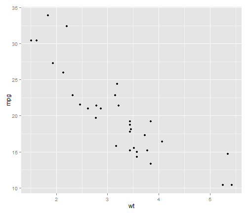

You can use Latex's typesetting via [mathJax](www.mathjax.org/)
$$\sum_{i=0}^n x_i$$
and present R code without evaluating:

```r
xs <- 1:5
plot(xs,xs)
```


---

### A Simple Plot

Let us create a simple scatterplot. 


```r
require(ggplot2)
qplot(wt, mpg, data = mtcars)
```

 


--- 

### A Table


```r
library(xtable)
options(xtable.type = "html")
xtable(head(mtcars))
```

<!-- html table generated in R 3.0.0 by xtable 1.7-1 package -->
<!-- Wed May 29 17:30:23 2013 -->
<TABLE border=1>
<TR> <TH>  </TH> <TH> mpg </TH> <TH> cyl </TH> <TH> disp </TH> <TH> hp </TH> <TH> drat </TH> <TH> wt </TH> <TH> qsec </TH> <TH> vs </TH> <TH> am </TH> <TH> gear </TH> <TH> carb </TH>  </TR>
  <TR> <TD align="right"> Mazda RX4 </TD> <TD align="right"> 21.00 </TD> <TD align="right"> 6.00 </TD> <TD align="right"> 160.00 </TD> <TD align="right"> 110.00 </TD> <TD align="right"> 3.90 </TD> <TD align="right"> 2.62 </TD> <TD align="right"> 16.46 </TD> <TD align="right"> 0.00 </TD> <TD align="right"> 1.00 </TD> <TD align="right"> 4.00 </TD> <TD align="right"> 4.00 </TD> </TR>
  <TR> <TD align="right"> Mazda RX4 Wag </TD> <TD align="right"> 21.00 </TD> <TD align="right"> 6.00 </TD> <TD align="right"> 160.00 </TD> <TD align="right"> 110.00 </TD> <TD align="right"> 3.90 </TD> <TD align="right"> 2.88 </TD> <TD align="right"> 17.02 </TD> <TD align="right"> 0.00 </TD> <TD align="right"> 1.00 </TD> <TD align="right"> 4.00 </TD> <TD align="right"> 4.00 </TD> </TR>
  <TR> <TD align="right"> Datsun 710 </TD> <TD align="right"> 22.80 </TD> <TD align="right"> 4.00 </TD> <TD align="right"> 108.00 </TD> <TD align="right"> 93.00 </TD> <TD align="right"> 3.85 </TD> <TD align="right"> 2.32 </TD> <TD align="right"> 18.61 </TD> <TD align="right"> 1.00 </TD> <TD align="right"> 1.00 </TD> <TD align="right"> 4.00 </TD> <TD align="right"> 1.00 </TD> </TR>
  <TR> <TD align="right"> Hornet 4 Drive </TD> <TD align="right"> 21.40 </TD> <TD align="right"> 6.00 </TD> <TD align="right"> 258.00 </TD> <TD align="right"> 110.00 </TD> <TD align="right"> 3.08 </TD> <TD align="right"> 3.21 </TD> <TD align="right"> 19.44 </TD> <TD align="right"> 1.00 </TD> <TD align="right"> 0.00 </TD> <TD align="right"> 3.00 </TD> <TD align="right"> 1.00 </TD> </TR>
  <TR> <TD align="right"> Hornet Sportabout </TD> <TD align="right"> 18.70 </TD> <TD align="right"> 8.00 </TD> <TD align="right"> 360.00 </TD> <TD align="right"> 175.00 </TD> <TD align="right"> 3.15 </TD> <TD align="right"> 3.44 </TD> <TD align="right"> 17.02 </TD> <TD align="right"> 0.00 </TD> <TD align="right"> 0.00 </TD> <TD align="right"> 3.00 </TD> <TD align="right"> 2.00 </TD> </TR>
  <TR> <TD align="right"> Valiant </TD> <TD align="right"> 18.10 </TD> <TD align="right"> 6.00 </TD> <TD align="right"> 225.00 </TD> <TD align="right"> 105.00 </TD> <TD align="right"> 2.76 </TD> <TD align="right"> 3.46 </TD> <TD align="right"> 20.22 </TD> <TD align="right"> 1.00 </TD> <TD align="right"> 0.00 </TD> <TD align="right"> 3.00 </TD> <TD align="right"> 1.00 </TD> </TR>
   </TABLE>


--- .class #id 

## Hans Rosling: No more boring data

<iframe width="420" height="315" src="http://www.youtube.com/embed/hVimVzgtD6w" frameborder="0" allowfullscreen></iframe>

---

Showing images:


---

## Animated List

> 1. Point 1
> 2. Point 2


<!-- Do it once to install needed packages:
# library(devtools)
# install_github('slidify', 'ramnathv')
# install_github('slidifyLibraries', 'ramnathv')
-->

<!-- need to execute:
library(slidify)
author("slidifyEg")  # create a new slidify project
slidify("index.Rmd") # can be made at RStudio with the 'Knit HTML'

publish('slidifyFolder', host = 'dropbox')  # to post at dbox's Public folder

# replace USER and REPO with your username and reponame
# publish(user = "USER", repo = "REPO", host = 'github')
------------------------------------------------------------ -->
